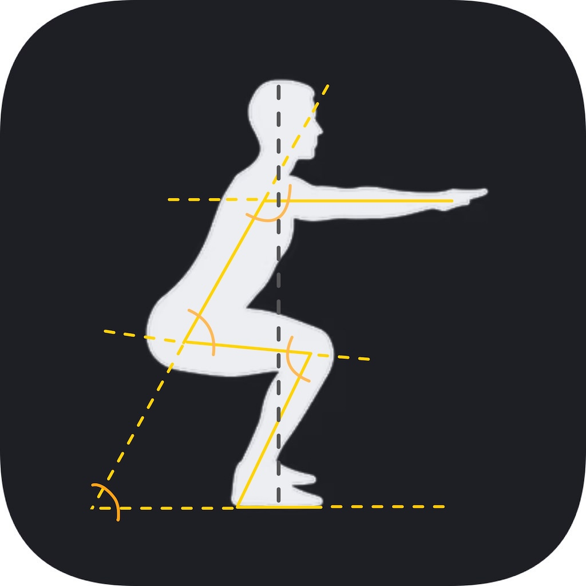
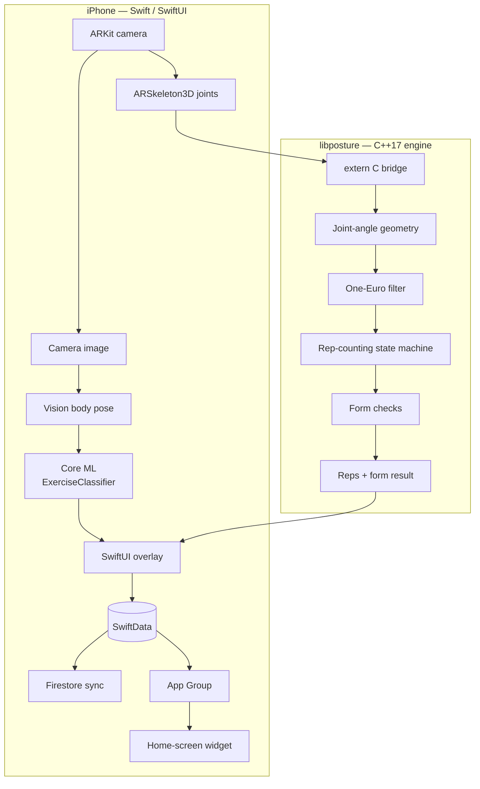
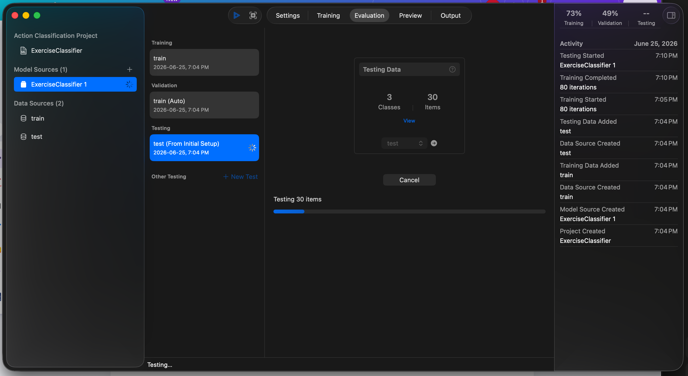
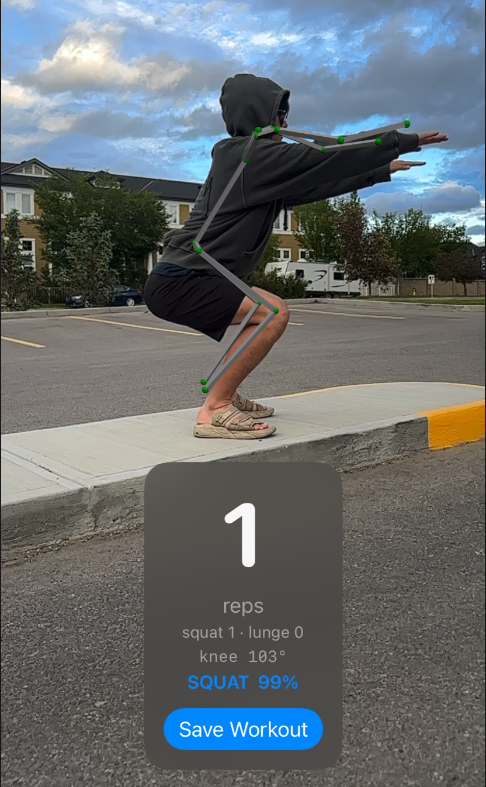
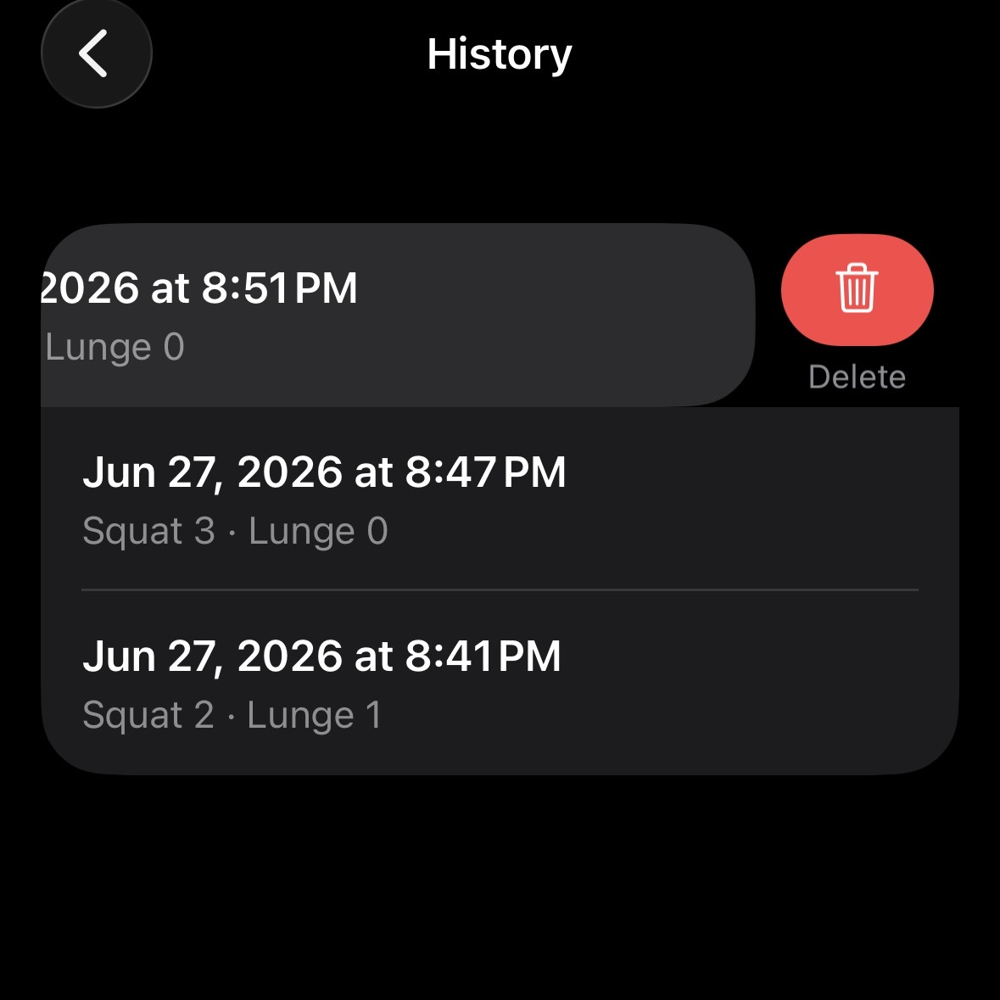
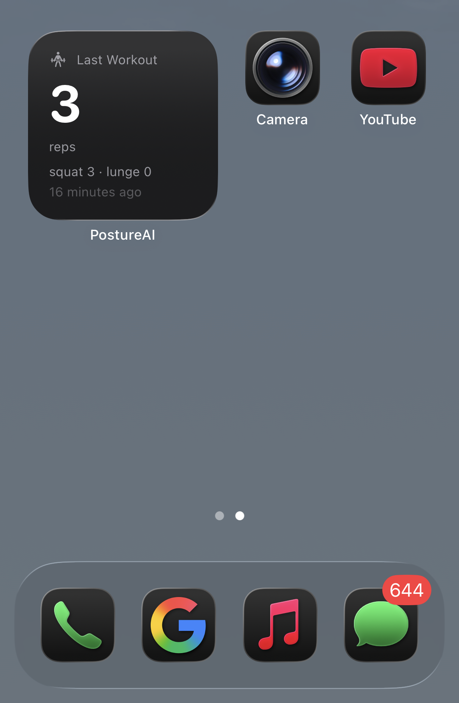
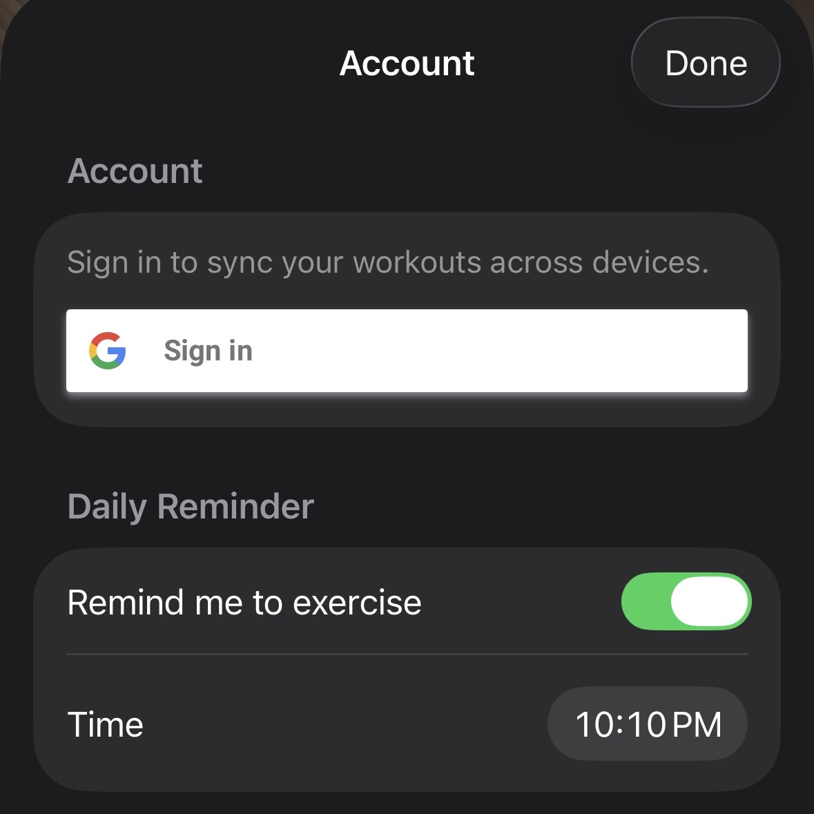
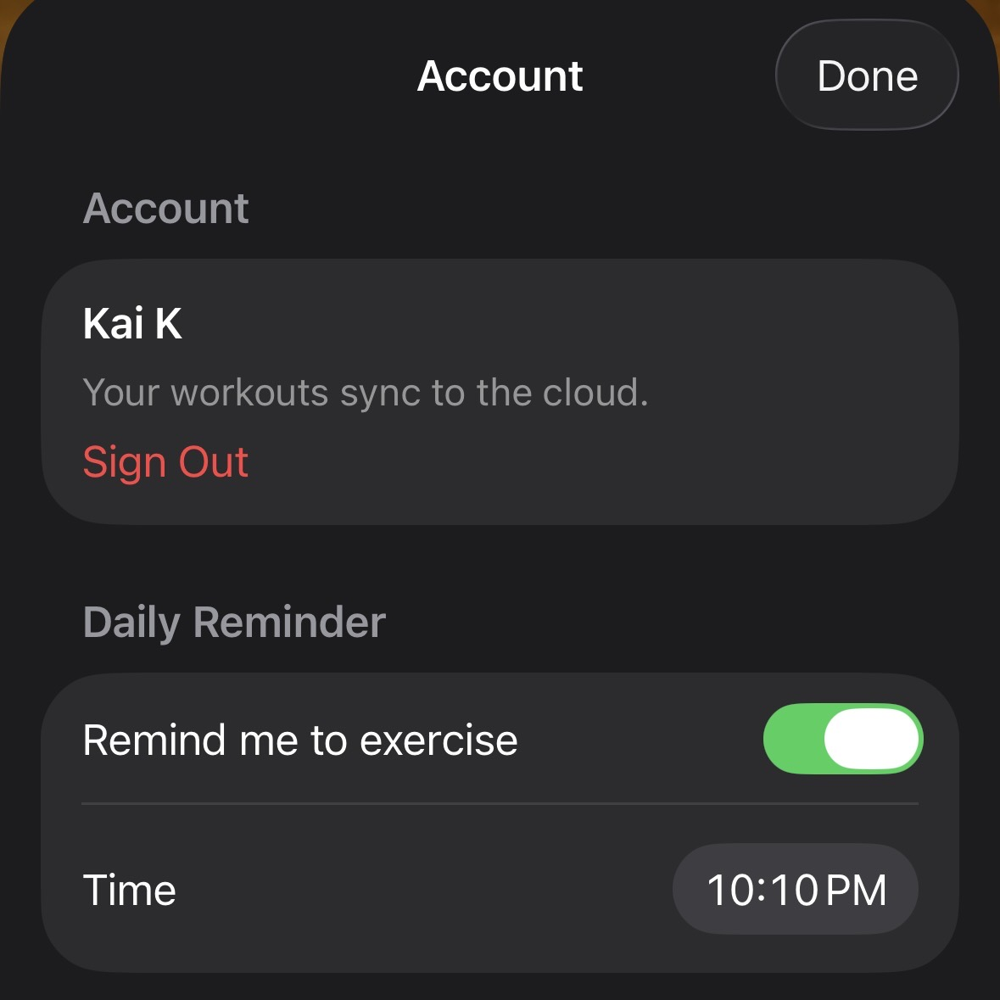
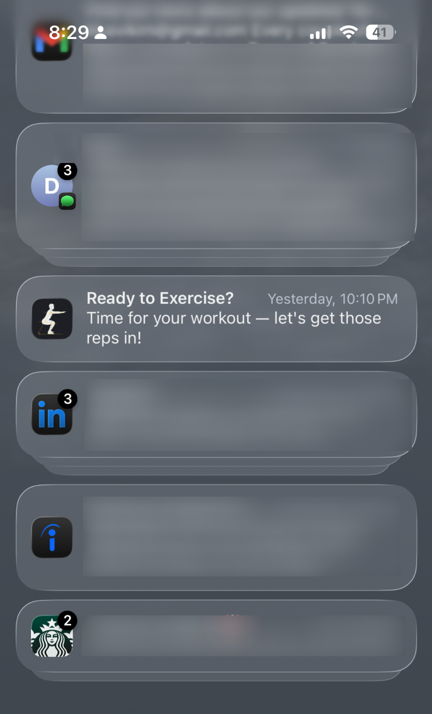

<div align="center">



# PostureAI

**Real-time squat & lunge coaching on iPhone — powered by a tested C++ analysis engine, ARKit body tracking, and on-device machine learning.**


</div>

---

## Demo

<div align="center">


&nbsp;&nbsp;


*Left: reps counted across different camera angles. Right: shallow squats are ignored — only full-depth reps count.*

</div>

---

## What it does

PostureAI watches you through the iPhone camera and, in real time:

- **Tracks your body in 3D** using ARKit and draws a live skeleton overlay
- **Counts reps** using joint-angle geometry — and rejects half-reps that don't hit depth
- **Checks your form** — flags shallow depth, excessive forward lean, and knees caving in
- **Identifies the exercise** (squat / lunge / idle) with a Core ML action classifier
- **Logs every workout** locally with SwiftData, **syncs to the cloud** via Firebase
- Surfaces your latest workout on a **home-screen widget** and a **daily reminder**

The app works fully **offline**; sign-in and cloud sync are optional.

---

## Architecture

The heart of the app is **[libposture](https://github.com/somekaicodes/libposture)** — a standalone, unit-tested **C++17** engine that does all the motion analysis.

The iOS app consumes it through a flat `extern "C"` bridge, so the same tested core could power Android or a desktop tool later.



**Why two layers?**

The deterministic, math-heavy logic lives in C++ where it can be unit-tested and CI-gated in isolation, independent of any Apple frameworks.

Swift handles the camera, ML, UI, and persistence.

---

## The C++ engine — [libposture](https://github.com/somekaicodes/libposture)

A clean, dependency-free C++17 library with **31 unit tests** (GoogleTest) gated by **GitHub Actions CI**:

| Module | Responsibility |
|---|---|
| `geometry` | 3D joint-angle math (knee angle, torso lean) |
| `filter` | One-Euro filter for low-lag signal smoothing |
| `rep_counter` | Hysteresis state machine — counts a rep only on a full down-and-up |
| `form` | Depth / forward-lean / knee-valgus checks |
| `squat_analyzer` | Ties the pipeline together, frame by frame |
| `posture_c` | Flat `extern "C"` API for the Swift bridge |

This is the part I'm proudest of: real-time motion analysis built from first principles, tested, and reusable across platforms.

---

## Machine learning pipeline

Beyond the deterministic geometry, the app runs a **Create ML action classifier** to recognize *which* exercise you're doing:

<div align="center">

</div>

- **Data:** ~90 short clips across 3 classes (squat / lunge / idle), recorded and labeled by hand
- **Training:** Create ML *Action Classification* (Vision body-pose sequences over a 60-frame window)
- **Inference:** `VNDetectHumanBodyPoseRequest` feeds a rolling pose window into the model on a background queue, in parallel with the geometry engine

> **Note on accuracy** — the model is at ~49% validation, which I acknowledge is low.
>
> It's trained on a small, single-subject dataset, and is planned to improve with more and varied training video.
>
> What it demonstrates is a Core ML action classifier I trained, adapted, and integrated into the app end to end (data → Create ML → Vision → on-device inference).

This pairs two complementary techniques: **deterministic geometry** for reliable rep counting, and **learned classification** for the harder problem of telling exercises apart — which rules don't scale to.

---

## Features

<div align="center">









</div>

- **Live tracking & rep panel** — 3D skeleton overlay, live knee angle, rep count, and exercise label
- **Workout history** — every saved session, persisted with SwiftData, swipe to delete
- **Home-screen widget** — your latest reps via a shared App Group container
- **Cloud sync** — Google Sign-In + Firestore, offline-first (local stays the source of truth)
- **Daily reminder** — a local "Ready to Exercise?" notification at a time you choose

---

## Tech stack

**Languages:** Swift 6, C++17
**iOS:** SwiftUI, ARKit, RealityKit, Vision, Core ML, SwiftData, WidgetKit, UserNotifications
**ML:** Create ML (Action Classification)
**Backend:** Firebase Auth (Google Sign-In), Cloud Firestore
**Tooling:** CMake, GoogleTest, GitHub Actions CI, Swift Package Manager

---

## Building

> Requires Xcode 16+, an iPhone with an **A12 chip or newer** (ARKit body tracking is not available in the Simulator).

```bash
git clone --recurse-submodules https://github.com/somekaicodes/PostureAI.git
```

1. Open `PostureAI.xcodeproj` in Xcode
2. Add your own `GoogleService-Info.plist` (Firebase) if you want cloud sync
3. Select your team under **Signing & Capabilities**, then run on a physical device

The C++ engine is included as a git submodule (`Vendor/libposture`) and compiled directly into the app target via a bridging header — no extra setup.

---

## Project structure

```
PostureAI/
├── PostureAI/              # iOS app (SwiftUI)
│   ├── BodyTrackingView    # ARKit session + per-frame pipeline
│   ├── SkeletonOverlay     # RealityKit skeleton rendering
│   ├── ExerciseRecognizer  # Vision + Core ML classifier
│   ├── PostureCore         # Swift wrapper over the C bridge
│   ├── WorkoutSession      # SwiftData model
│   ├── AuthService /        FirestoreService  # Firebase
│   └── WidgetSync          # App Group snapshot for the widget
├── WorkoutWidget/          # WidgetKit extension
└── Vendor/libposture/      # C++17 engine (git submodule)
```

---

## Development

Built with the help of **[Claude Code](https://claude.com/claude-code)** (Anthropic's agentic coding tool), used for pair-programming, architecture discussion, and code review across the project.

The design, decisions, and direction are my own — Claude Code was the workflow that helped me move fast while keeping the code clean and tested.
